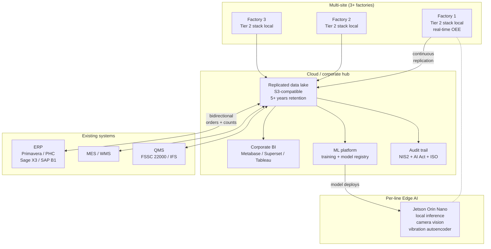

# Recipe 1 — Tier 3 (Industrial / Premium)

> Reference architecture. **No complete code here.** This is the tier where a specialist team makes the difference.

🇬🇧 EN (this file) · [🇵🇹 PT](README.md)

## What this document is for

Chapter 1 of the ebook describes Tier 3 as the level where an industrial SME stops "seeing what's happening in one factory" and starts:

- Integrating bidirectionally with the ERP (Primavera, PHC, Sage X3, SAP Business One — pick equivalents for non-PT markets).
- Coordinating multiple factories from a single control plane.
- Running vision / autoencoder models at the edge (Jetson Orin Nano) to catch defects before end-of-line.
- Meeting regulatory obligations (NIS2, EU AI Act, IATF 16949, ISO 9001) with auditable trails.

These goals span 3 to 9 months of project work, multidisciplinary team of 3 to 5 people, and typical CAPEX of €40,000 to €200,000 depending on the number of sites and the depth of ERP integration.

This README is the **basis for a conversation**. It shows the reference architecture and the decision points. It does not ship code — when you reach that stage, talk to us at [moredevs.ai/diagnostico](https://moredevs.ai/diagnostico).

## Reference architecture

## Essential components

### 1. Edge → hub replication

Each factory keeps the Tier 2 stack running **locally**. Loss of the link to the corporate hub cannot stop production. Data replicates asynchronously via:

- **MQTT bridge** between local brokers and the hub broker (preferred for low volume).
- **CDC (Change Data Capture)** on the local TimescaleDB, via Debezium or pglogical (preferred for high volume).
- **Native TimescaleDB replication** if the edition supports it.

Principle: the factory keeps producing even offline; on reconnect, it catches up.

### 2. Data lake / data warehouse

Central store with 5+ year retention for auditability. Sizing recommendations:

| Scale | Recommendation | Initial CAPEX |
|---|---|---|
| Small (3 factories, <50 GB/year) | MinIO on-prem + Parquet + DuckDB | ~€5,000 |
| Medium (5–10 factories) | S3 / Azure Blob + Iceberg + Athena / DuckDB | ~€15,000 |
| Large (10+ factories, audit-grade quality) | Snowflake / BigQuery + dbt | ~€30,000+ |

### 3. Bidirectional ERP integration

ERP integration is not "ship data into the ERP" — it's a continuous negotiation between what is on the shop floor and what is in work orders. Connectors are typically custom, with per-system entry points:

| ERP | Strategy |
|---|---|
| **Primavera** | Official REST API + custom adapters against the local database |
| **PHC** | API + extensions via PHC Scripting |
| **Sage X3** | REST API + Sage X3 workflow (4GL) |
| **SAP Business One** | Service Layer REST API + DI API where needed |

Common operations:
- Close production orders automatically from real-time counts.
- Detect raw material shortages and raise purchase requests.
- Feed dynamic BOMs from observed actuals.

### 4. Per-line Edge AI (optional)

Where it pays off, **Jetson Orin Nano (€500–700/machine)** runs local inference:

- **Camera vision** for defect detection before end-of-line (Chapter 4 details this for cutting; here we use it for quality).
- **Vibration autoencoder** to flag mechanical anomalies before failure (Chapter 2).
- **OCR** on labels / codes for automated traceability.

Models are deployed OTA from the hub. Model versioning is traceable down to the training sample (matters for the AI Act).

### 5. Security and regulation

The part that usually surprises an SME.

#### NIS2 (transposed in Portugal during 2024–2025)

Industrial SMEs scoped as **"essential"** or **"important"** (check with the national competent authority) must:

- Keep an up-to-date inventory of digital assets.
- Implement documented risk management.
- Notify significant incidents within 24 / 72 hours.
- Run continuity tests and have a recovery plan.

Tier 3 ships a lightweight SOC: centralised logging + SIEM (Wazuh or similar) + incident runbooks.

#### EU AI Act

Most Tier 3 models will land in **"limited risk"** (user information, usage logging). Models that affect direct safety (e.g. automatic accept/reject decisions on production quality) can be **"high risk"**, with heavy obligations:

- Technical documentation (Art. 11).
- Risk management systems (Art. 9).
- Event logging (Art. 12).
- Post-market monitoring (Art. 72).

The architecture needs to know **who decides what**, with audit trails per inference.

#### IATF 16949 (auto) / ISO 9001 / FSSC 22000 (food)

Tier 3 doesn't replace these certifications — it makes the traceability they demand trivially demonstrable from the data lake.

## When to bring in consultancy

Tier 3 isn't something a public repo can hand you. Reach out when:

- You have **3+ factories** or near-term plans to add another.
- You have **demanding regulatory certifications** — auto IATF 16949, pharma GMP, food IFS Higher Level.
- **Corporate customers** ask for real-time auditable data.
- Your internal team **lacks ML capacity** but needs to ship certifiable models.

[MoreDevs.ai](https://moredevs.ai) typically engages in one of the following:

| Format | Duration | Typical CAPEX |
|---|---|---|
| **Diagnostic** | 4 weeks | €3,000–6,000 |
| **Tier 3 pilot in 1 factory** | 8–12 weeks | €15,000–40,000 |
| **Multi-site roll-out** | 3–9 months | €40,000–200,000 |
| **Post-launch retainer** | monthly | €2,000–5,000/month |

[moredevs.ai/diagnostico](https://moredevs.ai/diagnostico) — free, no-commitment initial diagnostic.

## Public funding

For investments at this scale, in Portugal the relevant 2026 instruments are:

- **SICE — Inovação Produtiva** (Portugal 2030).
- **PRR** (Recovery and Resilience Plan) — some lines remain open in 2026.
- **AI Line for Companies** (Portuguese Promotional Bank — BPF).

In other EU countries: Made Smarter UK, Mittelstand Digital DE, Industria 4.0 IT, Transizione 5.0 IT, Horizon Europe.

Always check the official portals — programmes remain active but application windows close.

---

Back to [Recipe 1](../README.en.md).
