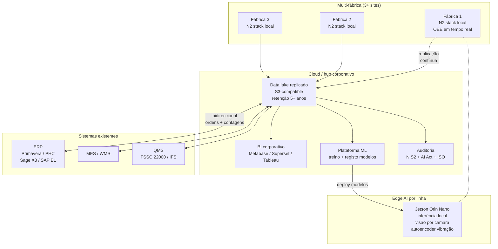

# Receita 1 — Nível 3 (Industrial / Premium)

> Arquitectura de referência. **Sem código completo.** Este nível é onde uma equipa especializada faz a diferença.

🇵🇹 PT (este ficheiro) · [🇬🇧 EN](README.en.md)

## Para que serve este documento

O Capítulo 1 do livro descreve o Nível 3 como o escalão onde uma PME industrial deixa de "ver o que se passa em uma fábrica" e passa a:

- Integrar bidireccionalmente com o ERP (Primavera, PHC, Sage X3, SAP Business One).
- Coordenar várias fábricas com um único painel de controlo.
- Correr modelos de visão / autoencoder no edge (Jetson Orin Nano) para detectar defeitos antes do fim de linha.
- Cumprir obrigações regulatórias (NIS2, EU AI Act, IATF 16949, ISO 9001) com auditoria automática.

Estes objectivos cobrem 3 a 9 meses de projecto, com equipa multidisciplinar (3 a 5 pessoas) e CAPEX típico de €40.000 a €200.000 dependendo do número de fábricas e da profundidade da integração ERP.

Este README é a **base para uma conversa**. Mostra a arquitectura de referência e os pontos de decisão. Não inclui código pronto a correr — quando chegar a esse ponto, fale connosco em [moredevs.ai/diagnostico](https://moredevs.ai/diagnostico).

## Arquitectura de referência

## Componentes essenciais

### 1. Replicação edge → hub

Cada fábrica mantém o stack do Nível 2 a correr **localmente**. A perda de rede para o hub corporativo não pode parar a produção. Os dados replicam de forma assíncrona via:

- **MQTT bridge** entre brokers locais e o broker do hub (preferido para baixo volume).
- **CDC (Change Data Capture)** sobre a Postgres / TimescaleDB local, com Debezium ou pglogical (preferido para alto volume).
- **Replicação nativa** TimescaleDB se a versão suportar.

Princípio: a fábrica continua a produzir mesmo offline; ao reconectar, sincroniza.

### 2. Data lake / data warehouse

Repositório central com retenção de 5+ anos para auditoria. Recomendações conforme o orçamento:

| Escala | Recomendação | CAPEX inicial |
|---|---|---|
| Pequeno (3 fábricas, <50 GB/ano) | MinIO on-prem + Parquet + DuckDB | ~€5.000 |
| Médio (5–10 fábricas) | S3 / Azure Blob + Iceberg + Athena / DuckDB | ~€15.000 |
| Grande (10+ fábricas, qualidade auditável) | Snowflake / BigQuery + dbt | ~€30.000+ |

### 3. Integração ERP bidireccional

A integração não é "enviar dados para o ERP" — é uma negociação contínua entre o que está no chão e o que está em ordens. Conectores tipicamente custom, com pontos de extensão por sistema:

| ERP | Estratégia |
|---|---|
| **Primavera** | API REST oficial + adapters custom para a base de dados local |
| **PHC** | API + extensões via PHC Scripting |
| **Sage X3** | REST API + workflow Sage X3 (4GL) |
| **SAP Business One** | Service Layer REST API + integração via DI API onde necessário |

Operações comuns:
- Fechar ordens de produção automaticamente a partir das contagens reais.
- Detectar falta de matéria-prima e abrir propostas de compra.
- Alimentar BOM dinâmica a partir das efectividades observadas.

### 4. Edge AI por linha (opcional)

Onde justifique, **Jetson Orin Nano (€500–700/máquina)** corre inferência local:

- **Visão por câmara** para detectar defeitos antes do fim de linha (Cap. 4 detalha isto para corte; aqui usa-se para qualidade).
- **Autoencoder de vibração** para sinalizar anomalia mecânica antes da falha (Cap. 2).
- **OCR** de etiquetas / códigos para rastreabilidade automática.

Deploy de modelos via OTA do hub. Versionamento dos modelos rastreável até à amostra (importante para o AI Act).

### 5. Segurança e regulamentação

Esta é a parte que normalmente surpreende uma PME.

#### NIS2 (transposta em Portugal 2024–2025)

PMEs industriais consideradas **"essenciais"** ou **"importantes"** (verificar pela autoridade competente) têm de:

- Manter inventário actualizado de activos digitais.
- Implementar gestão de risco documentada.
- Notificar incidentes significativos em 24 / 72 horas.
- Realizar testes de continuidade e ter plano de recuperação.

O Nível 3 inclui um SOC ligeiro: logging centralizado + SIEM (Wazuh ou similar) + plano de incidente em runbooks.

#### EU AI Act

A maioria dos modelos do Nível 3 será classificada como **"risco limitado"** (informação ao utilizador, log de utilização). Modelos que afectem segurança directa (ex.: decisão automática sobre fim de produção por qualidade) podem ser **"alto risco"**, com obrigações pesadas:

- Documentação técnica (Art. 11).
- Sistemas de gestão de risco (Art. 9).
- Logging de eventos (Art. 12).
- Monitorização pós-mercado (Art. 72).

A arquitectura precisa de saber **quem decide o quê** e ter trilho de auditoria por inferência.

#### IATF 16949 (auto) / ISO 9001 / FSSC 22000 (alimentar)

Não é o N3 que dispensa estas certificações — é o N3 que torna a rastreabilidade exigida por elas trivialmente provável a partir do data lake.

## Quando faz sentido pedir consultoria

O Nível 3 não se resolve com um repositório público. Faz sentido pedir apoio quando:

- **3+ fábricas** ou planos próximos para abrir a próxima.
- **Certificações regulatórias exigentes** — auto IATF 16949, farma GMP, agro-alimentar IFS Higher Level.
- **Clientes corporativos** que pedem dados auditáveis em tempo real.
- **Equipa interna sem capacidade ML** mas com necessidade de produção de modelos certificáveis.

A [MoreDevs.ai](https://moredevs.ai) pode entrar em qualquer dos seguintes formatos:

| Formato | Duração | CAPEX típico |
|---|---|---|
| **Diagnóstico** | 4 semanas | €3.000–6.000 |
| **Piloto N3 em 1 fábrica** | 8–12 semanas | €15.000–40.000 |
| **Roll-out multi-fábrica** | 3–9 meses | €40.000–200.000 |
| **Retainer pós-lançamento** | mensal | €2.000–5.000/mês |

[moredevs.ai/diagnostico](https://moredevs.ai/diagnostico) — diagnóstico inicial sem custo, sem compromisso.

## Apoios públicos típicos

Para investimentos desta magnitude, em Portugal os instrumentos relevantes em 2026 são:

- **SICE — Inovação Produtiva** (Portugal 2030).
- **PRR** (Plano de Recuperação e Resiliência) — algumas linhas continuam abertas em 2026.
- **Linha IA nas Empresas** (Banco Português de Fomento).

Em outros países da União Europeia: Made Smarter UK, Mittelstand Digital DE, Industria 4.0 IT, Transizione 5.0 IT, Horizon Europe.

Verifique sempre os portais oficiais — alguns programas mantêm-se activos mas com janelas de candidatura limitadas.

---

Voltar à [Receita 1](../README.md).
