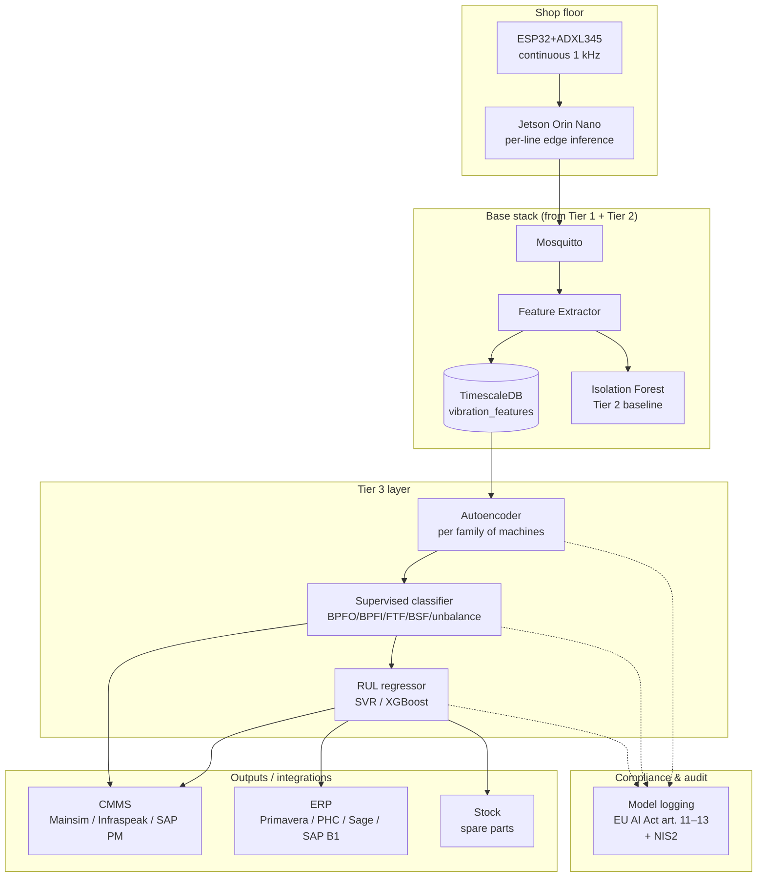

# Recipe 2 — Tier 3 (Industrial / Premium)

> Autoencoder, RUL estimation, CMMS integration, multi-site. **No complete code.** This is where a specialist team makes the difference.

🇬🇧 EN (this file) · [🇵🇹 PT](README.md)

## What this document is for

Tier 2 detects anomalies. Tier 3 answers three questions Tier 2 can't:

1. **When will it fail?** Per-machine RUL (Remaining Useful Life) estimation with confidence intervals.
2. **What kind of failure?** Supervised classification (BPFO / BPFI / FTF / BSF, or unbalance / misalignment) using labels from past maintenance.
3. **What do we do next?** CMMS integration that opens work orders automatically, with priority set from RUL.

This README is the **basis for a conversation**. It shows the reference architecture and the decision points. No running code — when you reach this point, talk to us at [moredevs.ai/diagnostico](https://moredevs.ai/diagnostico).

## Reference architecture

## Essential components

### 1. Per-line Edge AI (Jetson Orin Nano)

At 1 kHz × 3 axes × 6 machines, shipping every sample to the corporate hub wastes bandwidth and introduces latency. **Local inference on the Jetson** (~€500–700/line):

- Per-family autoencoder pre-trained offline.
- Reconstruction in < 5 ms per window.
- Only the reconstruction error, anomaly score and extracted features go up.
- The hub pushes **model updates** when it retrains (versioning + rollback are mandatory for the AI Act).

### 2. Per-family autoencoder

Tier 2's IF was per-machine. The Tier 3 autoencoder is **per family** (all presses share one model). Wins:

- Learns a latent space where a new press inherits the family model immediately.
- Reconstruction error at specific frequencies hints at the fault type.
- Fewer models to maintain (3 families × 3 shifts vs N machines).

Stack: PyTorch + ONNX export → Jetson. 10–50 k parameters, train offline on a GPU box.

### 3. Supervised classifier

Once you have **labels** from past maintenance (e.g. "2025-03-14, BPFO outer-race fault, part 6204-2RS"), train a classifier:

- Input: spectral features + multi-band RMS + history.
- Output: fault type + confidence.
- Model: XGBoost or ExtraTrees usually suffice; neural nets only pay off above ~5k samples.

Accuracy in the 70–85% range — doesn't replace the technician but **speeds up triage**.

### 4. RUL — Remaining Useful Life

The hardest piece. Viable approaches:

| Approach | When it makes sense | Accuracy |
|---|---|---|
| **Threshold + extrapolation** (linear/exponential) | Sparse history; clear monotonic signal | ±30% |
| **SVR / XGBoost** with history features | At least 5 labelled past failures | ±15–20% |
| **LSTM / Transformer time-series** | >50 labelled failures, non-monotonic signal | ±10–15% |
| **Physics-based** (Paris law for fatigue) | You know the bearing geometry | ±5–10% |

Chapter 2 argues: **start simple (extrapolation)** and only invest in complex models when the data justifies it. RUL ±30% warning 10 days out beats RUL ±5% that only becomes real after 6 months of history.

### 5. CMMS integration

When RUL drops below N days, the system **automatically opens a work order** in the CMMS:

| CMMS | Integration |
|---|---|
| **Infraspeak** | Official REST API — `/work-orders` endpoint |
| **Mainsim** | REST API + webhooks |
| **SAP PM** | OData + BAPI; heavier but integrates with the technical order |
| **Custom CMMS** | Generic webhook |

The work order carries: machine, detected fault type, suggested part (via BOM cross-reference), estimated RUL, link to the dashboard.

### 6. EU AI Act compliance

Models that influence maintenance decisions are usually **limited risk** (the final call stays human). But required:

- **Art. 11 — Technical documentation**: architecture, training dataset, validation metrics, known limitations.
- **Art. 12 — Logging**: every critical inference with timestamp + input vector + output + model_id + version.
- **Art. 72 — Post-market monitoring**: drift detection, false-positive / false-negative tracking.

The architecture needs a **model registry** (MLflow or similar) with sample-level traceability.

## When to bring in consultancy

Tier 3 isn't "install a library". Reach out when:

- You have **5+ critical machines** where one day of downtime costs >€10k.
- You have **maintenance history** (even in spreadsheets) — that unlocks supervised classification.
- You face **demanding regulatory compliance** (IATF 16949, GMP) asking for auditable models.
- Your internal team **lacks ML capacity** but needs shop-floor explainability.

[MoreDevs.ai](https://moredevs.ai) typically engages in:

| Format | Duration | Typical CAPEX |
|---|---|---|
| **Technical diagnostic** | 3 weeks | €4,000–7,000 |
| **Tier 3 pilot on 1 family** | 10–14 weeks | €25,000–60,000 |
| **Multi-family roll-out** | 4–6 months | €60,000–250,000 |
| **Post-launch retainer** | monthly | €2,500–6,000/month |

[moredevs.ai/diagnostico](https://moredevs.ai/diagnostico).

## Public funding

PT 2026: **SICE — Inovação Produtiva (PT2030)**, **PRR**, **AI Line (BPF)**. EU: **Horizon Europe**, **Digital Europe**, **Mittelstand Digital** (DE), **Made Smarter** (UK).

---

Back to [Recipe 2](../README.en.md).
