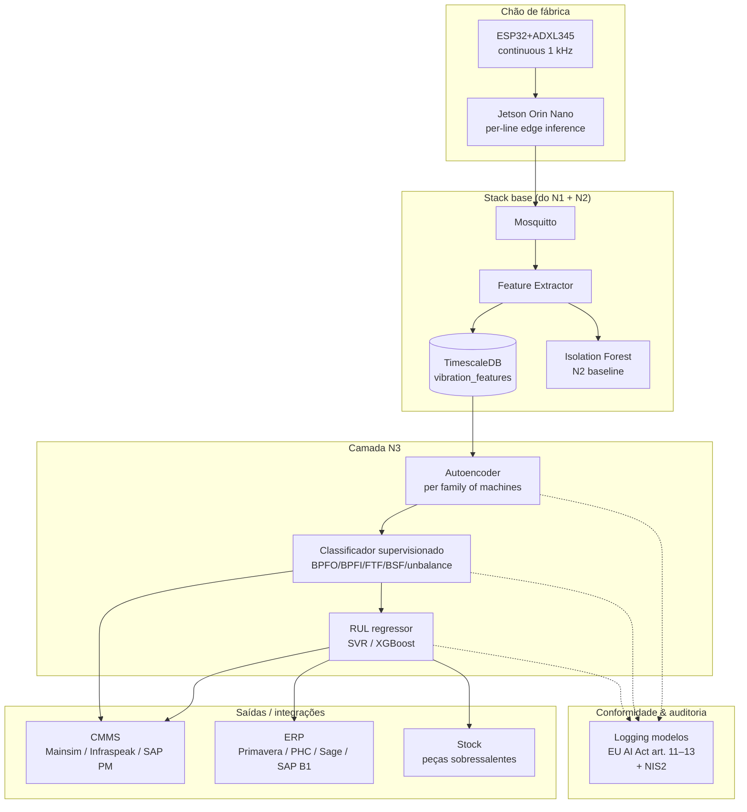

# Receita 2 — Nível 3 (Industrial / Premium)

> Autoencoder, estimativa de RUL, integração CMMS, multi-fábrica. **Sem código completo.** Aqui faz-se equipa especializada.

🇵🇹 PT (este ficheiro) · [🇬🇧 EN](README.en.md)

## Para que serve este documento

A Nível 2 detecta anomalia. O Nível 3 responde a três perguntas que a N2 não responde:

1. **Quando vai falhar?** Estimativa de RUL (Remaining Useful Life) por máquina, com intervalos de confiança.
2. **Que tipo de falha?** Classificação supervisionada (BPFO / BPFI / FTF / BSF, ou unbalance / misalignment) usando rótulos de manutenções anteriores.
3. **O que fazemos a seguir?** Integração com o CMMS para abrir ordem de trabalho automática com prioridade calculada a partir do RUL.

Este README é a **base para uma conversa**. Mostra a arquitectura de referência e os pontos de decisão. Não inclui código corrido — quando chegar a esse ponto, fale connosco em [moredevs.ai/diagnostico](https://moredevs.ai/diagnostico).

## Arquitectura de referência

## Componentes essenciais

### 1. Edge AI por linha (Jetson Orin Nano)

A 1 kHz × 3 eixos × 6 máquinas, transportar tudo até ao hub corporativo desperdiça largura de banda e introduz latência. **Inferência local no Jetson** (~€500–700/linha):

- Modelo autoencoder pré-treinado por família de máquinas (prensas, CNCs, electroerosões).
- Reconstrução em < 5 ms por janela.
- Só sobe ao hub: erro de reconstrução, score de anomalia, e features extraídas.
- O hub manda **deploy de novos modelos** quando re-treina (versionamento e rollback obrigatório por AI Act).

### 2. Autoencoder por família

O IF da N2 era per-máquina. O autoencoder do N3 é **per-família** (todas as prensas partilham um modelo). Vantagens:

- Aprende um espaço latente onde uma prensa nova herda imediatamente o modelo da família.
- O erro de reconstrução em frequências específicas dá pistas sobre o tipo de fault.
- Menos modelos para manter (3 famílias × 3 turnos vs N máquinas × ?).

Stack típico: PyTorch + ONNX export → Jetson. ~10–50 k parâmetros, treino offline em GPU desktop.

### 3. Classificador supervisionado

Quando há **rótulos** de manutenções anteriores (e.g. "intervenção em 2025-03-14, causa: BPFO chumaceira externa, peça 6204-2RS"), treina-se um classificador:

- Input: features espectrais + RMS multi-banda + history.
- Output: tipo de falha + confiança.
- Modelo: XGBoost ou ExtraTrees são geralmente suficientes; redes neurais só compensam com >5k exemplos.

A precisão pode rondar 70–85% — não substitui o técnico, mas **acelera a triagem**.

### 4. RUL — Remaining Useful Life

A peça mais "premium" — e a mais difícil. Abordagens viáveis:

| Abordagem | Quando faz sentido | Precisão |
|---|---|---|
| **Threshold + extrapolação** (linear/exponencial) | Pouco histórico; sinal monotónico claro | ±30% |
| **SVR / XGBoost** com features históricas | Há ≥5 falhas históricas rotuladas | ±15–20% |
| **LSTM / Transformer time-series** | >50 falhas históricas, sinal não-monotónico | ±10–15% |
| **Modelos físicos** (Paris law para fadiga) | Conhecimento da chumaceira disponível | ±5–10% |

O Capítulo 2 do livro defende: **começar simples (extrapolação)** e só investir em modelos complexos quando os dados o justificam. Um RUL ±30% que avisa 10 dias antes vale muito mais que um RUL ±5% que só se torna real após 6 meses de história.

### 5. Integração CMMS

Quando o RUL cai abaixo de N dias, o sistema **abre automaticamente uma ordem de trabalho** no CMMS:

| CMMS PT | Estratégia |
|---|---|
| **Infraspeak** | API REST oficial — endpoint `/work-orders` |
| **Mainsim** | API REST + webhooks |
| **SAP PM** | OData + BAPI; mais pesado mas integra com a ordem técnica |
| **CMMS custom** | Webhook genérico |

A ordem inclui: máquina, tipo de fault detectado, peça sugerida (a partir de cross-reference com BOM), RUL estimado, link para o dashboard.

### 6. Conformidade EU AI Act

Modelos que afectam decisões de manutenção são tipicamente **risco limitado** (decisão final continua humana). Mas obrigatório:

- **Art. 11 — Documentação técnica**: arquitectura, dataset de treino, métricas de validação, limitações conhecidas.
- **Art. 12 — Logging**: cada inferência crítica com timestamp + input vector + output + model_id + version.
- **Art. 72 — Monitorização pós-mercado**: drift detection, false-positive / false-negative tracking.

A arquitectura precisa de um **model registry** (MLflow ou similar) com rastreabilidade até à amostra.

## Quando faz sentido pedir consultoria

O N3 não é "instale-se uma biblioteca". Faz sentido pedir apoio quando:

- **5+ máquinas críticas** onde a paragem custa >€10k/dia.
- **Existe histórico de manutenções** (mesmo que em Excel) — isso desbloqueia classificação supervisionada.
- **Compliance regulatória exigente** (IATF 16949, GMP) que pede modelos auditáveis.
- **Equipa interna sem capacidade ML** mas com necessidade de explicabilidade ao chão de fábrica.

A [MoreDevs.ai](https://moredevs.ai) tipicamente entra em:

| Formato | Duração | CAPEX típico |
|---|---|---|
| **Diagnóstico técnico** | 3 semanas | €4.000–7.000 |
| **Piloto N3 em 1 família** | 10–14 semanas | €25.000–60.000 |
| **Roll-out multi-família** | 4–6 meses | €60.000–250.000 |
| **Retainer pós-lançamento** | mensal | €2.500–6.000/mês |

[moredevs.ai/diagnostico](https://moredevs.ai/diagnostico).

## Apoios públicos

PT 2026: **SICE — Inovação Produtiva (PT2030)**, **PRR**, **Linha IA do BPF**. UE: **Horizon Europe**, **Digital Europe**, **Mittelstand Digital** (DE), **Made Smarter** (UK).

---

Voltar à [Receita 2](../README.md).
